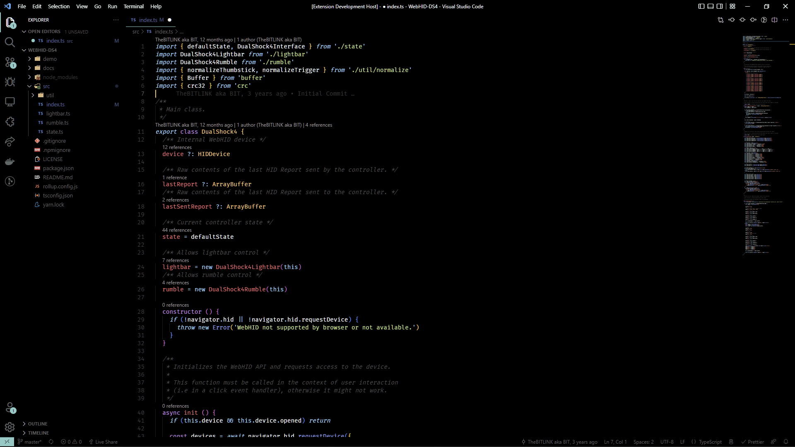

# Material Theme OLED (for VSCode)

A fork/modification of the [Material Theme Darker](https://github.com/material-theme/vsc-material-theme) visual studio code theme,
replacing the default background with pure black. Intended for use with OLED displays.

